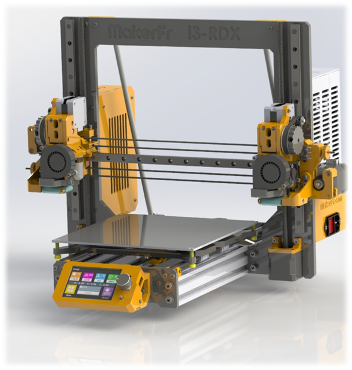

# MakerFr i3-RDX <!-- omit in toc -->

Ce dépôt contient tout le nécessaire pour construire une MakerFr i3-RDX.

# Table des contenus <!-- omit in toc -->
- [Tutoriel de montage](#tutoriel-de-montage)
- [Cadre](#cadre)
- [Pièces à imprimer](#pièces-à-imprimer)
- [Pièces à sourcer](#pièces-à-sourcer)
- [Firmware BTT Octopus v1.1](#firmware-btt-skr-pro-12)
- [Firmware BTT TFT35](#firmware-btt-tft35)
- [PrusaSlicer - MakerFr Edition + .INI pour PrusaSlicer "normal"](#prusaslicer---makerfr-edition)

## Tutoriel de montage
[Disponible dans le dépôt](./PDF/)

## Cadre

[Disponible dans le dépôt](./Frame/)

## Pièces à imprimer

[Disponibles dans le dépôt](./STL/)

## Pièces à sourcer

[Disponibles dans le dépôt](./BOM/)

## Firmware BTT Octopus 1.1 (version 2.1.2.4 upgradé)

### Pourquoi cette version spéciale ? <!-- omit in toc -->
Dans la release 2.0.7.2 de MarlinFirmware, il y a un bug concernant la ventilation, empêchant l'utilisation correcte des modes de duplication (Duplication / Miroir). Ce bug a été corrigé par l'équipe de MakerFr et intégré dans MarlinFirmware, cependant il n'y a pas eu de nouvelle release depuis la correction. Afin de garantir la cohérence du code et de sa configuration (la branche bugfix est en constante évolution et n'est pas garantie fonctionnelle à tout instant), il est nécessaire de proposer une version spécifique MakerFr dans un état stable.

Il s'agit d'une branche basée sur le tag 2.0.7.2 dans laquelle ont été intégrés la configuration pour la MakerFr i3-RDX ainsi qu'un cherry pick (sorte de copier/coller) du correctif qui a été introduit dans la branche bugfix.

Ceci en attendant une éventuelle 2.0.7.3 qui intègrera nativement ce correctif.

### Fichiers <!-- omit in toc -->
[Sources de MarlinFirmware modifié](https://github.com/Kachidoki2807/Marlin/tree/MakerFr_2.0.7.2_bugfix%2321206)

[Binaire pré-compilé pour Octopus 1.1 de BTT](/Firmware/BTT_Octopus/firmware.bin)

Le fichier .bin est à mettre sur la carte µSD de la BTT SKR PRO 1.2. Il sera automatiquement renommé en .CUR après la mise à jour.

## Firmware BTT TFT35
Concernant le TFT, le problème est tout autre. Il n'y a aucune gestion de version dans le dépôt officiel du constructeur. Ainsi le firmware évolue de jour en jour, sans aucune cohérence ni garantie d'un état stable. La maintenance devient alors très pénible.

Pour palier à cela, chez MakerFr on vous propose une "version" figée qui date de début 2021, avec laquelle nous avons travaillé depuis. La configuration est adaptée à l'i3-RDX. MISE A JOUR FAITE EN 2024.

[Binaire pré-compilé pour le TFT35 de BTT](Firmware/BTT_TFT35/BIGTREE_TFT35_V3.0.26.x.bin)

Copier tout le contenu de ce dossier sur la carte SD du BTT TFT35. Les différents éléments seront automatiquement renommés en .CUR après la mise à jour.

> **Astuce :** N'oubliez pas qu'il vous est possible de télécharger le contenu de tout ce présent dépôt d'un seul bloc en [ZIP](../../archive/refs/heads/master.zip).

## PrusaSlicer - MakerFr Edition (Fichiers .ini pour PrusaSlicer "normal" dispo)

### Pourquoi cette édition ? <!-- omit in toc -->
Cette édition spéciale corrige certaines imperfections de PrusaSlicer concernant la gestion de la ventilation, ainsi que la dimension de la tour de purge.

Mais elle intègre également un tout nouveau profil constructeur, qui contient une série de paramètres prédéfinis. Ainsi il n'y a qu'à passer par le configurateur pour avoir un slicer en état de générer un G-Code compatible avec l'i3-RDX d'un clic.

Une réflexion est en cours sur la suite à donner à cette édition, des tickets supports on été ouvert chez Prusa, mais pas encore résolu. Concernant le profil constructeur, il pourra également évoluer indépendamment du slicer. Une intégration dans la base de profils de Prusa est envisageable, mais il faudra probablement l'étoffer un peu avant d'en arriver là.

### Fichiers <!-- omit in toc -->
Les sources seront peut-être mises à disposition dans l'avenir.

[Application pré-compilée pour Windows](../../raw/master/Slicer/PrusaSlicer%20-%20MakerFr%20Edition.zip)
